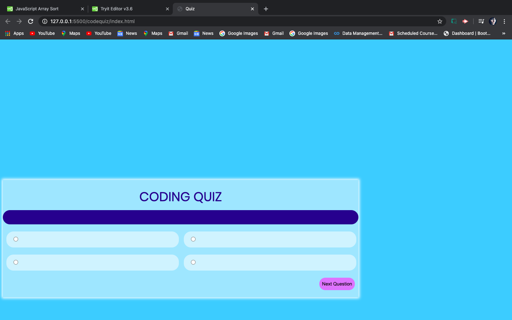

# codequiz

-This application is a short quiz on coding
-This application focuses on HTML, CSS, and mainly javascript, utilizing and array of objects as well as a timer feature.
-When answering the quiz, incorrect answers are to decrease the time on the timer
-The score of the quiz is to be stored

